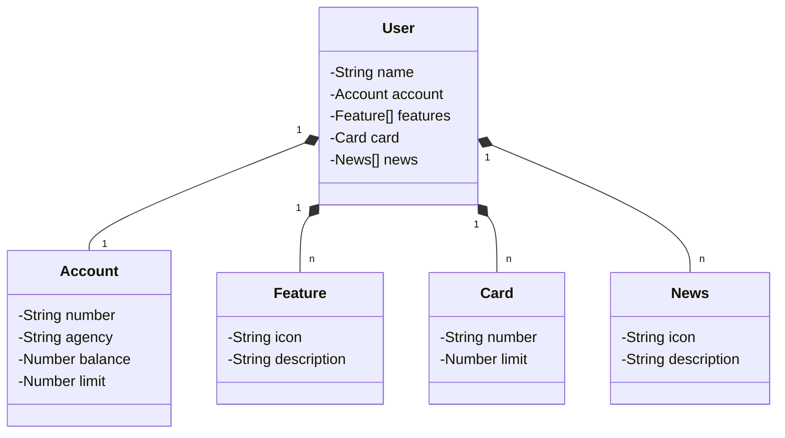

# PROJETO API-RESTful
Projeto RESTful API com Spring Boot, Java e Railway

## Principais Tecnologias
* VS Code 1.99.3: IDE de editor de código-fonte desenvolvido pela Microsoft para Windows, Linux e macOS. 
* Java 21: Linguagem multiplataforma, orientada a objetos e centrada em rede
* Maven 4.0.0 (3.11.0 para rodar no Railway): Ferramenta de automação de compilação
* Spring Boot 3.4.5: Ferramenta open source que simplifica a utilização de estruturas baseadas em Java
* Spring Data JPA: Framework de programação dentro do Spring Framework para acesso e manipulação de dados.
* OpenAPI 2.8.6 (Swagger): Especificação para descrever interfaces de API REST
* Railway: Plataforma baseada na nuvem que visa tornar o processo de desenvolvimento mais simples e acessível

## Diagrama de Classes

